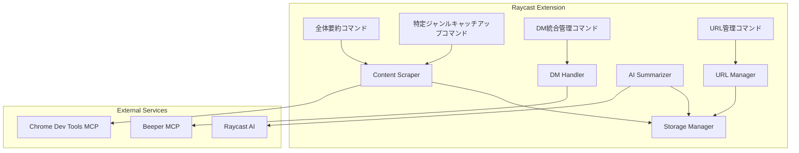

# Design Document

## Overview

SNS Routerは、Raycast拡張機能として実装され、Chrome Dev Tools MCPとBeeper MCPを活用してWeb情報を取得・要約します。3つの独立したコマンド（全体要約、特定ジャンルキャッチアップ、DM統合管理）を提供し、それぞれ異なるユースケースに対応します。

### 技術スタック

- **フレームワーク**: Raycast API (@raycast/api)
- **言語**: TypeScript
- **MCP統合**: Chrome Dev Tools MCP, Beeper MCP
- **AI**: Raycast AI API
- **ストレージ**: Raycast LocalStorage API

## Architecture

### システムアーキテクチャ図



### コンポーネント構成

1. **Commands Layer**: 各Raycastコマンドのエントリーポイント
2. **Service Layer**: ビジネスロジックを処理するサービス
3. **MCP Integration Layer**: 外部MCPサーバーとの通信
4. **Storage Layer**: データの永続化

## Components and Interfaces

### 1. URL Manager

URL登録・管理を担当するコンポーネント。

```typescript
interface RegisteredURL {
  id: string;
  name: string;
  url: string;
  description?: string;
  isPreset: boolean;
  isEnabled: boolean;
  lastFetchedAt?: Date;
  itemCount: number;
}

interface URLManager {
  // プリセットURLの初期化
  initializePresets(): Promise<void>;
  
  // URL一覧取得
  getAllURLs(): Promise<RegisteredURL[]>;
  
  // 有効なURL一覧取得
  getEnabledURLs(): Promise<RegisteredURL[]>;
  
  // URL追加
  addURL(url: string, name: string, description?: string): Promise<RegisteredURL>;
  
  // URL更新
  updateURL(id: string, updates: Partial<RegisteredURL>): Promise<void>;
  
  // URL削除（カスタムURLのみ）
  deleteURL(id: string): Promise<void>;
  
  // 有効/無効切り替え
  toggleURL(id: string): Promise<void>;
}
```

### 2. Content Scraper

Chrome Dev Tools MCPを使用してWebページから情報を取得。スクロールやページ遷移を含めて広範囲に情報を収集。

```typescript
interface MessageItem {
  id: string;
  sourceURLId: string;
  sourceName: string;
  url: string;
  author?: string;
  content: string;
  timestamp: Date;
  metadata?: Record<string, any>;
}

interface ScrapingOptions {
  scrollCount?: number;        // スクロール回数（デフォルト: 5）
  scrollDelay?: number;         // スクロール間隔（ms、デフォルト: 2000）
  followLinks?: boolean;        // リンクを辿るか（デフォルト: false）
  maxPages?: number;            // 最大ページ数（デフォルト: 3）
  waitForSelector?: string;     // 待機するセレクタ
}

interface ContentScraper {
  // Chrome Dev Tools MCPの接続確認
  checkConnection(): Promise<boolean>;
  
  // 単一URLから情報取得（スクロール・ページ遷移含む）
  scrapeURL(url: RegisteredURL, options?: ScrapingOptions): Promise<MessageItem[]>;
  
  // 複数URLから情報取得
  scrapeMultipleURLs(urls: RegisteredURL[], options?: ScrapingOptions): Promise<MessageItem[]>;
  
  // ページをスクロールして追加コンテンツを読み込み
  scrollAndCollect(url: string, scrollCount: number, delay: number): Promise<MessageItem[]>;
  
  // リンクを辿ってページ遷移
  followLinksAndCollect(url: string, maxPages: number): Promise<MessageItem[]>;
  
  // スクレイピング結果の保存
  saveItems(items: MessageItem[]): Promise<void>;
}
```

### 3. AI Summarizer

Raycast AIを使用して情報を要約。

```typescript
interface SummaryOptions {
  mode: 'overview' | 'targeted';
  prompt?: string;
  groupBySource?: boolean;
}

interface Summary {
  id: string;
  content: string;
  keywords: string[];
  sourceItems: MessageItem[];
  createdAt: Date;
  options: SummaryOptions;
}

interface AISummarizer {
  // 全体要約生成
  generateOverviewSummary(items: MessageItem[]): Promise<Summary>;
  
  // プロンプトベース要約生成
  generateTargetedSummary(items: MessageItem[], prompt: string): Promise<Summary>;
  
  // 要約の保存
  saveSummary(summary: Summary, name: string): Promise<void>;
  
  // 保存済み要約の取得
  getSavedSummaries(): Promise<Summary[]>;
}
```

### 4. DM Handler

Beeper MCPを使用してDMを管理。

```typescript
interface DirectMessage {
  id: string;
  platform: string;
  conversationId: string;
  sender: string;
  content: string;
  timestamp: Date;
  isRead: boolean;
}

interface DMHandler {
  // Beeper MCPの接続確認
  checkConnection(): Promise<boolean>;
  
  // 未読DM取得
  getUnreadMessages(): Promise<DirectMessage[]>;
  
  // DM返信
  replyToMessage(messageId: string, content: string): Promise<void>;
  
  // 既読マーク
  markAsRead(messageId: string): Promise<void>;
}
```

### 5. Storage Manager

Raycast LocalStorageを使用したデータ永続化。

```typescript
interface StorageManager {
  // URL管理
  saveURLs(urls: RegisteredURL[]): Promise<void>;
  loadURLs(): Promise<RegisteredURL[]>;
  
  // Message Item管理
  saveMessageItems(items: MessageItem[]): Promise<void>;
  loadMessageItems(filters?: {
    sourceURLId?: string;
    startDate?: Date;
    endDate?: Date;
  }): Promise<MessageItem[]>;
  clearMessageItems(filters?: {
    sourceURLId?: string;
    startDate?: Date;
    endDate?: Date;
  }): Promise<void>;
  
  // 要約管理
  saveSummary(summary: Summary, name: string): Promise<void>;
  loadSummaries(): Promise<Array<Summary & { name: string }>>;
  deleteSummary(id: string): Promise<void>;
  
  // 統計情報
  getStats(): Promise<{
    totalItems: number;
    itemsBySource: Record<string, number>;
    oldestItem?: Date;
    newestItem?: Date;
  }>;
}
```

## Data Models

### RegisteredURL

```typescript
type RegisteredURL = {
  id: string;              // UUID
  name: string;            // 表示名（例: "X (Twitter)"）
  url: string;             // 監視対象URL
  description?: string;    // 説明
  isPreset: boolean;       // プリセットURLかどうか
  isEnabled: boolean;      // 有効/無効
  lastFetchedAt?: Date;    // 最終取得日時
  itemCount: number;       // 取得済みアイテム数
  scrapingOptions?: {      // スクレイピング設定
    scrollCount?: number;
    scrollDelay?: number;
    followLinks?: boolean;
    maxPages?: number;
    waitForSelector?: string;
  };
};
```

### MessageItem

```typescript
type MessageItem = {
  id: string;              // UUID
  sourceURLId: string;     // 取得元URL ID
  sourceName: string;      // 取得元名
  url: string;             // 元投稿のURL
  author?: string;         // 投稿者
  content: string;         // 本文
  timestamp: Date;         // 投稿日時
  metadata?: {             // プラットフォーム固有のメタデータ
    likes?: number;
    retweets?: number;
    replies?: number;
    [key: string]: any;
  };
};
```

### Summary

```typescript
type Summary = {
  id: string;              // UUID
  content: string;         // 要約本文（Markdown形式）
  keywords: string[];      // 抽出されたキーワード
  sourceItems: MessageItem[]; // 要約元のアイテム
  createdAt: Date;         // 作成日時
  options: {
    mode: 'overview' | 'targeted';
    prompt?: string;
    groupBySource?: boolean;
  };
};
```

### DirectMessage

```typescript
type DirectMessage = {
  id: string;              // UUID
  platform: string;        // プラットフォーム名
  conversationId: string;  // 会話ID
  sender: string;          // 送信者
  content: string;         // メッセージ本文
  timestamp: Date;         // 送信日時
  isRead: boolean;         // 既読/未読
};
```

## Command Implementations

### 1. 全体要約コマンド (All Summarize)

**ファイル**: `src/all-summarize.tsx`

**フロー**:
1. 有効な全登録URLを取得
2. Chrome Dev Tools MCPで各URLから情報をスクレイピング
   - 各URLで5回スクロール（2秒間隔）
   - 動的に読み込まれるコンテンツを収集
3. 取得した情報をStorageに保存（重複排除）
4. AI Summarizerで全体要約を生成
5. URL別にセクション分けして表示

**UI構成**:
- List View: URL別の要約セクション
- Detail View: 各セクションの詳細と元Message Itemへのリンク
- Actions: ブラウザで開く、コピー、要約を保存
- Progress Indicator: スクレイピング進捗表示

### 2. 特定ジャンルキャッチアップコマンド (Topic Catchup)

**ファイル**: `src/topic-catchup.tsx`

**フロー**:
1. プロンプト入力フィールドを表示
2. ユーザーがプロンプトを入力（例: "XでAI系の最新ニュースを教えて"）
3. プロンプトから対象URLを特定
4. Chrome Dev Tools MCPで情報をスクレイピング
   - プロンプトに応じてスクロール回数を調整（デフォルト: 5回）
   - 必要に応じてリンクを辿る（例: プロフィールページへの遷移）
5. AI Summarizerでプロンプトに基づいた要約を生成
6. 回答形式で表示

**UI構成**:
- Form View: プロンプト入力
- Detail View: AI回答と関連Message Item
- Actions: ブラウザで開く、コピー
- Progress Indicator: スクレイピング進捗表示

### 3. DM統合管理コマンド (DM Manager)

**ファイル**: `src/dm-manager.tsx`

**フロー**:
1. Beeper MCPへの接続確認
2. 全プラットフォームから未読DMを取得
3. 時系列順にリスト表示
4. ユーザーが返信を入力
5. Beeper MCP経由で返信を送信

**UI構成**:
- List View: DM一覧（プラットフォーム名、送信者、プレビュー、未読バッジ）
- Detail View: 会話履歴
- Actions: 返信、既読マーク

### 4. URL管理コマンド (Manage URLs)

**ファイル**: `src/manage-urls.tsx`

**フロー**:
1. 登録済みURL一覧を表示（プリセット + カスタム）
2. 各URLの有効/無効トグル
3. カスタムURL追加フォーム（スクレイピングオプション設定含む）
4. カスタムURL削除（確認ダイアログ付き）

**UI構成**:
- List View: URL一覧（名前、URL、有効/無効、最終取得日時、アイテム数）
- Form View: URL追加フォーム
  - URL、名前、説明
  - スクレイピングオプション（スクロール回数、ページ遷移など）
- Actions: 有効/無効切り替え、削除、今すぐ更新、設定編集

## Error Handling

### Chrome Dev Tools MCP接続エラー

```typescript
try {
  const isConnected = await contentScraper.checkConnection();
  if (!isConnected) {
    await showToast({
      style: Toast.Style.Failure,
      title: "Chrome Dev Tools MCP未接続",
      message: "MCP設定を確認してください",
    });
    return;
  }
} catch (error) {
  await showToast({
    style: Toast.Style.Failure,
    title: "接続エラー",
    message: error.message,
  });
}
```

### スクレイピングエラー

```typescript
try {
  const items = await contentScraper.scrapeURL(url);
} catch (error) {
  console.error(`Failed to scrape ${url.name}:`, error);
  await showToast({
    style: Toast.Style.Failure,
    title: `${url.name}の取得に失敗`,
    message: "リトライしますか？",
    primaryAction: {
      title: "リトライ",
      onAction: () => retryScrap(url),
    },
  });
}
```

### AI要約エラー

```typescript
try {
  const summary = await aiSummarizer.generateOverviewSummary(items);
} catch (error) {
  await showToast({
    style: Toast.Style.Failure,
    title: "要約生成に失敗",
    message: "もう一度お試しください",
  });
}
```

## Testing Strategy

### Unit Tests

各コンポーネントの単独テスト:
- URL Manager: URL追加・削除・更新ロジック
- Storage Manager: データ永続化・取得ロジック
- AI Summarizer: プロンプト生成ロジック

### Integration Tests

コンポーネント間の連携テスト:
- Content Scraper + Storage Manager: スクレイピング結果の保存
- AI Summarizer + Storage Manager: 要約の保存・取得
- URL Manager + Content Scraper: URL設定に基づくスクレイピング

### Manual Tests

実際のMCPサーバーとの連携テスト:
- Chrome Dev Tools MCPでの実際のWebページスクレイピング
- Beeper MCPでの実際のDM送受信
- Raycast AIでの実際の要約生成

### Test Data

テスト用のモックデータ:
- プリセットURL: X, Instagram, Discord, Slack
- サンプルMessage Item: 各プラットフォームの投稿データ
- サンプルDM: 複数プラットフォームのDMデータ

## Performance Considerations

### スクレイピングの最適化

- 並列処理: 複数URLを同時にスクレイピング（Promise.all）
- タイムアウト設定: 各URLに対して60秒のタイムアウト（スクロール・ページ遷移を考慮）
- エラーハンドリング: 一部のURLが失敗しても他のURLは継続
- スクロール制御: 2秒間隔で5回スクロール（ボット規制回避）
- ページ遷移制限: 最大3ページまで遷移（過度な負荷を防止）
- 重複排除: 同じMessage Itemを複数回取得しないようにID管理

### ストレージの最適化

- Message Item上限: 1000件まで保存
- 古いデータの自動削除: 30日以上前のデータを自動削除
- インデックス: sourceURLIdとtimestampでインデックス化

### AI要約の最適化

- トークン制限: 入力テキストを最大10,000トークンに制限
- バッチ処理: 大量のMessage Itemは分割して要約
- キャッシュ: 同じ入力に対する要約結果をキャッシュ

## Security Considerations

### データプライバシー

- ローカルストレージのみ使用（外部サーバーへの送信なし）
- ブラウザのログイン済みセッションを利用（認証情報の保存なし）
- Message Itemは暗号化せず平文で保存（個人実験用のため）

### MCP接続のセキュリティ

- Chrome Dev Tools MCP: ローカルホストのみ接続
- Beeper MCP: 公式MCPサーバーのみ使用
- タイムアウト設定: 長時間の接続を防止

## Future Enhancements

### Phase 2 (優先度: 中)

- 自動更新機能: 定期的に登録URLから情報を取得
- 通知機能: 新しいMessage Itemが見つかったら通知
- フィルタリング: キーワード、日付範囲でのフィルタリング

### Phase 3 (優先度: 低)

- エクスポート機能: 要約をMarkdownファイルとしてエクスポート
- 統計ダッシュボード: 取得データの統計情報を可視化
- カスタムスクレイピングルール: URLごとにスクレイピングルールを設定
